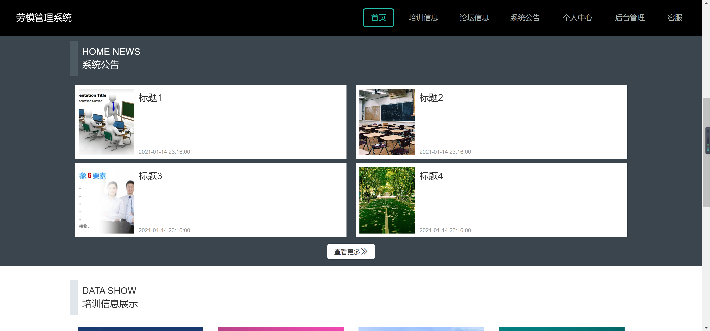
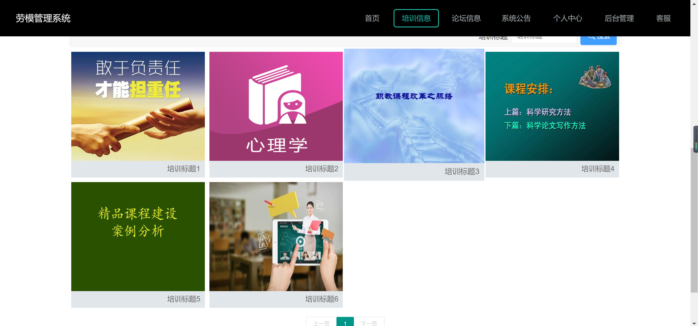
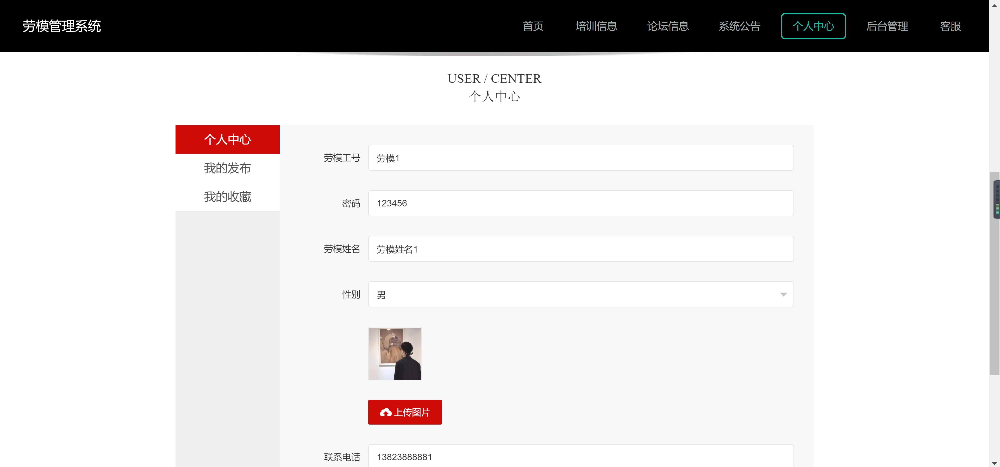
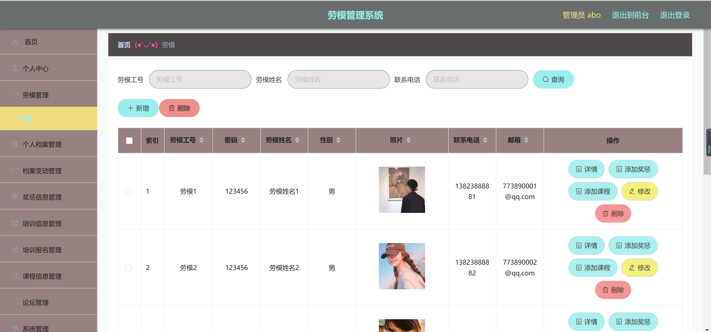
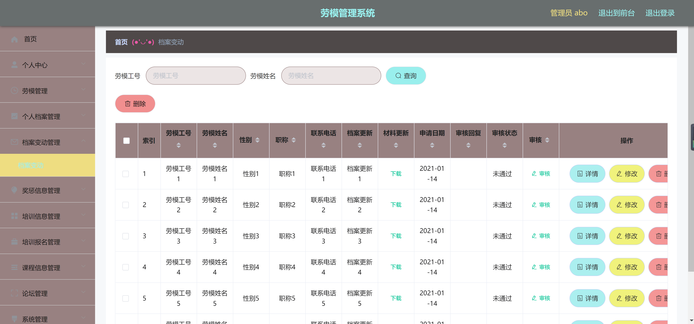

<h1 align="center">劳模管理系统</h1>

## 简介
劳模管理系统：角色分为管理员和劳模；功能包括个人中心、劳模信息管理、培训信息展示、系统公告和用户注册登录，旨在高效管理和记录劳模信息。    --计算机毕业设计源码；毕设源码；java毕业设计源码

## 联系方式

<h3 align="center">获取完整代码与数据库文件 + 微信：deepguan QQ: 86050149 QQ群: 783742310</h3>

<h3 align="center">可帮忙远程部署 包运行成功！提供远程部署、修改代码、设计文档指导、代码讲解等服务！</h3>

## 功能介绍（完整见运行截图）
管理员：基本功能包括登录、退出、注册。系统具有劳模管理、档案管理、奖励信息管理及审核功能，支持添加、修改、删除操作。首页导航栏提供访问培训信息、论坛信息、系统公告、后台管理及客服的链接。界面简洁明了，支持文件下载和档案信息变动查询。  
劳模：基本功能包括登录和注册。个人中心可查看及修改基本信息，如工号、密码、姓名、性别、联系电话，支持上传头像。用户可查找和管理自己的奖惩记录、课程信息及收藏项。系统提供系统公告、培训信息、论坛信息的访问，帮助劳模便捷管理个人档案和相关信息。

## 运行截图

本代码来源于网络,仅供学习参考使用!

